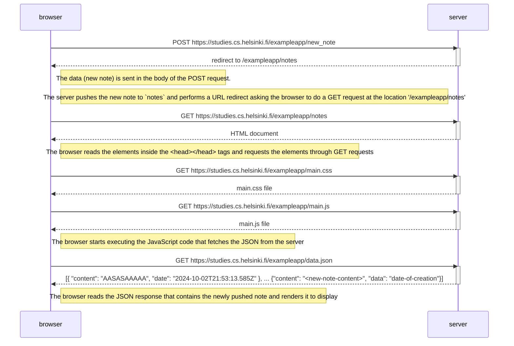

```mermaid
sequenceDiagram
    participant browser
    participant server

    browser->>server: POST https://studies.cs.helsinki.fi/exampleapp/new_note
    activate server
    server-->>browser: redirect to /exampleapp/notes
    deactivate server

    Note right of browser: The data (new note) is sent in the body of the POST request.
    Note left of server: The server pushes the new note to `notes` and performs a URL redirect asking the browser to do a GET request at the location '/exampleapp/notes'

    browser->>server: GET https://studies.cs.helsinki.fi/exampleapp/notes
    activate server
    server-->>browser: HTML document
    deactivate server

    Note right of browser: The browser reads the elements inside the <head></head> tags and requests the elements through GET requests

    browser->>server: GET https://studies.cs.helsinki.fi/exampleapp/main.css
    activate server
    server-->>browser: main.css file
    deactivate server

    browser->>server: GET https://studies.cs.helsinki.fi/exampleapp/main.js
    activate server
    server-->>browser: main.js file
    deactivate server

    Note right of browser: The browser starts executing the JavaScript code that fetches the JSON from the server

    browser->>server: GET https://studies.cs.helsinki.fi/exampleapp/data.json
    activate server
    server-->>browser: [{ "content": "AASASAAAAA", "date": "2024-10-02T21:53:13.585Z" }, ... {"content": "<new-note-content>", "data": "date-of-creation"}]
    deactivate server

    Note right of browser: The browser reads the JSON response that contains the newly pushed note and renders it to display
```
