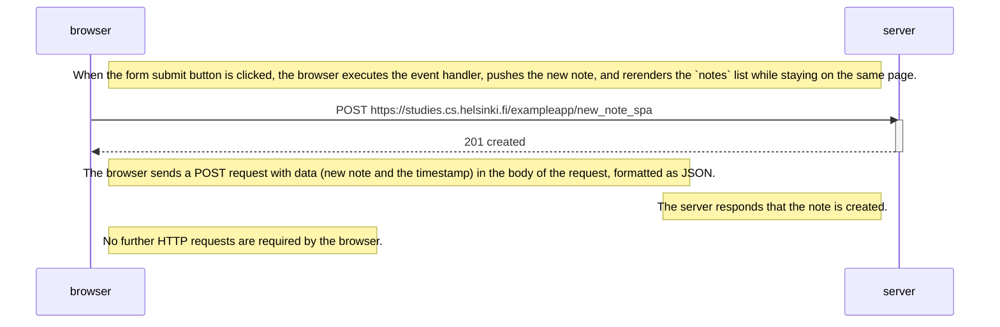

```mermaid
sequenceDiagram
    participant browser
    participant server

    Note right of browser: When the form submit button is clicked, the browser executes the event handler, pushes the new note, and rerenders the `notes` list while staying on the same page.
    
    browser->>server: POST https://studies.cs.helsinki.fi/exampleapp/new_note_spa
    activate server
    server-->>browser: 201 created
    deactivate server

    Note right of browser: The browser sends a POST request with data (new note and the timestamp) in the body of the request, formatted as JSON.
    Note left of server: The server responds that the note is created.
    Note right of browser: No further HTTP requests are required by the browser.
```
